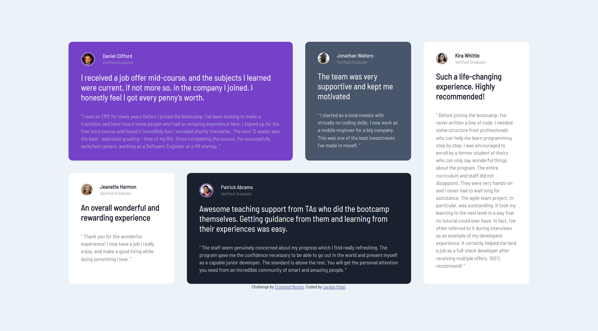
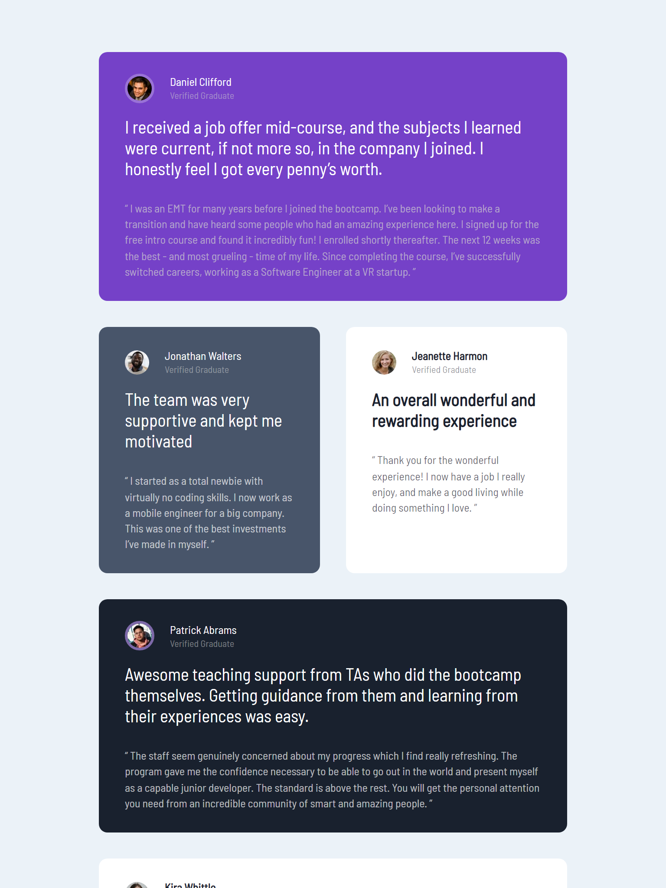
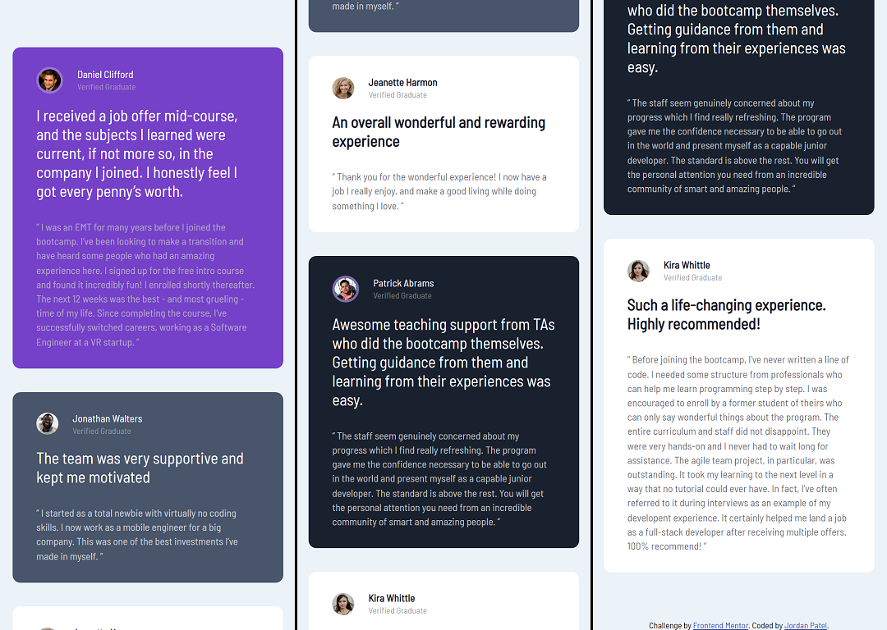

# Frontend Mentor - Testimonials grid section solution

This is a solution to the [Testimonials grid section challenge on Frontend Mentor](https://www.frontendmentor.io/challenges/testimonials-grid-section-Nnw6J7Un7). Frontend Mentor challenges help you improve your coding skills by building realistic projects. 

Difficulty: Level 2 (junior) 

## Overview

### The challenge

Users should be able to:

- View the optimal layout for the site depending on their device's screen size

### Links

- Live Site URL: [https://jordansgit.github.io/testimonials-grid-section/](https://jordansgit.github.io/testimonials-grid-section/)

### Built with

- HTML5 
- CSS 

### Screenshot

Desktop

Tablet 

Mobile 

